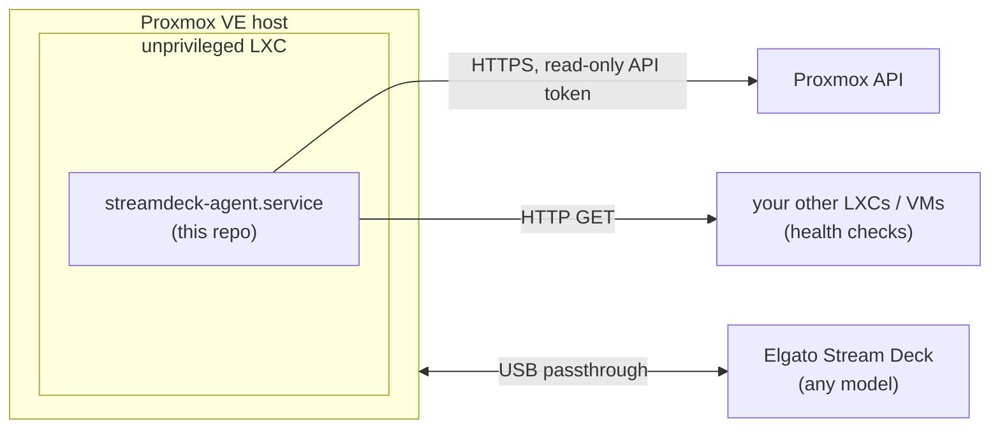

# streamdeck-proxmox-agent

Turn an Elgato Stream Deck into a live status panel for a Proxmox VE host -
CPU/RAM/disk, container/VM status, network throughput, and HTTP health
checks for whatever services you run - running headless inside its own
unprivileged LXC container.




The agent never has write access to anything: it authenticates to the
Proxmox API with a token scoped to the built-in **PVEAuditor** (read-only)
role, and it only ever issues plain `GET` requests to the services you list
for health checks.

## Why an LXC instead of running it on the host directly

- Keeps a third-party USB-facing Python process off the Proxmox host itself.
- The container only needs the USB device passed through to it and a
  read-only API token - if it's ever compromised, it can't change anything
  on the cluster.
- Runs as a dedicated non-root user inside the container, not root.

## Supported hardware

Any Stream Deck model exposing a rectangular button grid — Mini, Original,
MK.2, XL, Neo - works, because the agent reads the grid size and key-image
resolution from the connected device at startup instead of assuming one
model. On most models the bottom-left and bottom-right keys of the grid
become **prev/next** page navigation, leaving every other key as a data
tile. On a model with dedicated tactile buttons below the grid (currently
just the Neo), those physical buttons are used for prev/next instead, so
every key in the grid is free as a data tile; the Neo's small LCD strip
also shows the current page name and a live clock.
(Devices with a screen strip/dial instead of a full grid, like Stream Deck
Plus, aren't targeted by this project.)

## What it shows

Pages are generated automatically and paginated to fit however many tile
keys your device has:

| Page | Contents |
|---|---|
| Host | CPU %, RAM %, disk %, swap %, load average, uptime |
| Guests | every LXC/VM on the node: running/stopped, CPU % |
| Network | total in/out throughput across all guests, top talkers |
| Speedtest | press any key on this page to run a real internet speed test (download/upload/ping) from the agent's container, which shares the host's uplink |
| Health | green/red reachability tile for each URL you configure |

Tiles are color-coded green/amber/red based on configurable thresholds.


## Prerequisites

- A Proxmox VE host with an Elgato Stream Deck plugged into it
- Root shell on that host
- [GitHub CLI / general familiarity not required] — just `pct`, `pveum`,
  `pveam`, which ship with Proxmox VE

## Quick start

Run both scripts as root **on the Proxmox host**:

```bash
git clone <this-repo-url>
cd streamdeck-proxmox-agent

# 1. Create the LXC, passthrough the USB device, create a read-only API token.
#    Override any variable you need to (see the script header for the full list).
CTID=110 STATIC_IP=192.168.1.50/24 GATEWAY=192.168.1.1 ./scripts/01-host-setup.sh

# 2. Install the agent inside that container.
CTID=110 ./scripts/02-deploy-agent.sh
```

The token secret printed by step 1 is shown **once** and is not stored
anywhere in this repo — copy it into the container's config now:

```bash
pct exec 110 -- nano /etc/streamdeck-agent/config.yaml
```

Fill in:
- `proxmox.node` — your node's name (`pvesh get /nodes` on the host)
- `proxmox.token_secret` — the secret from step 1
- `health_checks` — any HTTP(S) services you want a status tile for

Then start it:

```bash
pct exec 110 -- systemctl start streamdeck-agent
pct exec 110 -- journalctl -u streamdeck-agent -f
```

The Stream Deck should light up with the Host page within a few seconds.
Page through Guests → Network → Health with next/prev - the bottom-right
and bottom-left grid keys on most models, or the dedicated tactile buttons
below the screen on a Neo.

## Doing it by hand

The scripts are just a repeatable version of these steps, useful if you
want to fold this into existing infra-as-code instead:

1. **udev rule** on the host so USB permissions don't block the container's
   mapped UID from opening the device: `/etc/udev/rules.d/99-streamdeck.rules`
   sets `MODE="0666"` for USB vendor ID `0fd9` (Elgato).
2. **API token**: `pveum user add streamdeck@pve`, `pveum aclmod / -user
   streamdeck@pve -role PVEAuditor`, `pveum user token add streamdeck@pve
   agent --privsep 0`.
3. **LXC**: `pct create` an unprivileged Debian 12 container, then append to
   its config (`/etc/pve/lxc/<CTID>.conf`):
   ```
   lxc.cgroup2.devices.allow: c 189:* rwm
   lxc.mount.entry: /dev/bus/usb dev/bus/usb none bind,optional,create=dir
   ```
   This binds the whole USB bus tree (not one device node), so the Stream
   Deck stays visible even if it's unplugged/replugged and enumerates as a
   different bus/device number.
4. **Inside the container**: `apt install python3-venv python3-pip
   libhidapi-libusb0 libusb-1.0-0 fonts-dejavu-core`, then a venv with
   `pip install streamdeck pillow requests pyyaml speedtest-cli`, the files
   from `agent/`, and the systemd unit.

## Configuration reference (`config.yaml`)

| Key | Meaning |
|---|---|
| `proxmox.host` / `port` | Proxmox host's management address and API port (usually 8006) |
| `proxmox.node` | Node name as Proxmox knows it |
| `proxmox.token_id` / `token_secret` | The read-only API token from setup |
| `proxmox.verify_ssl` | Set `true` only if the API has a trusted (non-self-signed) cert |
| `refresh_seconds` | Poll interval for host/guest/network stats |
| `device_not_found_restart_seconds` | If no Stream Deck is found for this long, exit so systemd's `Restart=always` brings up a clean process (works around hidapi/libusb getting stuck and never re-detecting the device after a physical unplug/replug). `0` disables this and retries forever instead |
| `brightness` | Stream Deck backlight, 0-100 |
| `idle_dim_seconds` | Dim the backlight after this many seconds of no key presses (`0` disables dimming). Any key press wakes it instantly. Mainly about avoiding a static image burned in 24/7 rather than real power savings — these devices only draw ~1-2W regardless. |
| `idle_brightness` | Backlight level while idle (used only if `idle_dim_seconds` > 0) |
| `thresholds.warn` / `bad` | Usage % at which a tile turns amber / red |
| `enable_speedtest` | Whether to show the Speedtest page (it uses real bandwidth each time it runs) |
| `health_check_interval_seconds` | How often health checks run (kept separate from `refresh_seconds` since HTTP checks are slower) |
| `health_check_timeout_seconds` | Per-request timeout for each health check |
| `health_checks` | List of `{name, url}` — add or remove as many as you like |

Config path defaults to `/etc/streamdeck-agent/config.yaml`; override with
the `STREAMDECK_AGENT_CONFIG` environment variable if you need a different
location (e.g. for running the agent outside a container while developing).

## Extending it

Each page is a small class with one method:

```python
class Page:
    def tiles(self, state, size, pct_color):
        """Return up to `page_size` PIL.Image tiles sized `size`."""
```

To add a page, subclass `Page`, implement `tiles()` using whatever's on
`state` (or add a new field to `State` populated by your own poller), and
add it to `Agent.compute_pages()`. `render_tile()` / `render_nav()` are
generic helpers already used by the built-in pages.

## Troubleshooting

- **No Stream Deck found** (agent logs `no Stream Deck found, retrying`):
  check `lsusb` on the *host* shows the device, then `pct exec <CTID> --
  ls -la /dev/bus/usb/*/*` shows it inside the container with `rw-rw-rw-`
  permissions. If not, re-run the udev rule step and unplug/replug the
  device. If it stays undetected past `device_not_found_restart_seconds`,
  the agent exits on its own and systemd restarts it with a clean process —
  check `journalctl -u streamdeck-agent` for the "exiting for a clean
  restart" log line.
- **Blank/black keys**: check `journalctl -u streamdeck-agent` for
  exceptions — usually a bad `config.yaml` (missing field, bad token).
- **All tiles show `no data` / health checks all `DOWN`**: the container
  can't reach the Proxmox API or your services — check its network config
  and that `proxmox.host`/`node` are correct.
- **Permission denied opening the device**: the udev rule didn't apply, or
  you're on a kernel/udev combo that resets permissions on replug — check
  `ls -la /dev/bus/usb/.../...` on the host after replugging.

## Security notes

- The API token is scoped to `PVEAuditor` (read-only) at `/` — it can see
  cluster/node/guest status but cannot start, stop, or modify anything.
- The container is unprivileged and runs the agent as a dedicated non-root
  user.
- `config.yaml` (containing the token secret) is `chmod 600`, owned by that
  user, and is gitignored — only `config.example.yaml` with placeholder
  values is committed.

## License

MIT — see [LICENSE](LICENSE).
